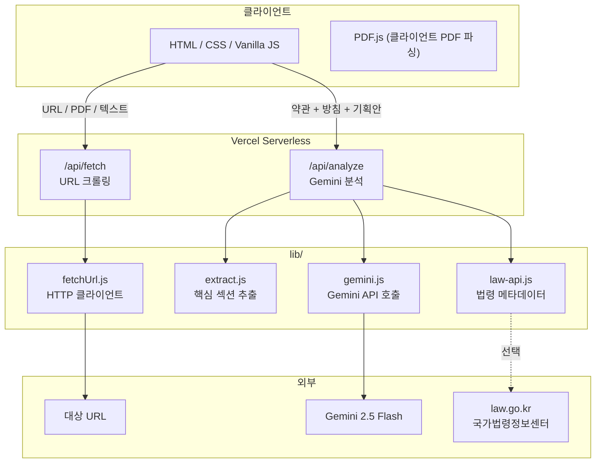

# Lawform — AI 준법 검토 도구

   

> 이용약관·개인정보처리방침을 복붙만 하면 AI가 준법 검토해주는 웹 서비스

법무팀 없는 스타트업·소규모 서비스 운영자를 위해, 새 기능 기획 시 이용약관·개인정보처리방침 준법 여부를 자동으로 검토합니다. 리스크 항목, 공지 의무, 약관 개정 초안까지 한 번에 제공합니다.

---

## 아키텍처



---

## 주요 기능

| 기능 | 설명 |
|------|------|
| 문서 수집 | URL 크롤링 / PDF 업로드(클라이언트 파싱) / 직접 텍스트 입력 |
| 준법 검토 | 기획안 vs 약관·방침 비교, severity (critical / warning / info / ok) 판정 |
| 공지 가이드 | 약관규제법·전자상거래법·개인정보보호법 기준 7일/30일 공지 기간 및 채널 제안 |
| 공지 초안 자동 생성 | 이메일 / 띠배너 / 공지사항용 문구 원클릭 복사 |
| 법령 자동 반영 | law.go.kr에서 최신 시행일·개정 현황 참조 (로컬 환경 한정) |

---

## 기술 스택

| 구분 | 기술 |
|------|------|
| Frontend | HTML5, CSS3, Vanilla JS (빌드 없음), PDF.js 3.11, Pretendard / JetBrains Mono |
| Backend | Node.js 18+ (외부 프레임워크 없음, `jsonrepair` 의존성 1개) |
| AI | Google Gemini 2.5 Flash API (무료 티어) |
| 배포 | Vercel (Serverless Functions + 정적 호스팅) |
| 법령 | 국가법령정보센터 Open API — `LAW_API_OC` 설정 시 활성화 |

---

## 시작하기

```bash
git clone https://github.com/zziyoonii/lawform.git
cd lawform
npm install

# 환경 변수 설정
cp .env.example .env
# .env 파일에서 GEMINI_API_KEY 입력

node server.js
# → http://localhost:3001
```

---

## 환경 변수

| 변수 | 필수 | 설명 |
|------|------|------|
| `GEMINI_API_KEY` | ✅ | [Google AI Studio](https://aistudio.google.com/app/apikey)에서 발급 |
| `LAW_API_OC` | ❌ | [open.law.go.kr](https://open.law.go.kr) OC 인증값. 미설정 시 법령 참조 없이 분석 |
| `GA_MEASUREMENT_ID` | ❌ | Google Analytics 4 ID (e.g. `G-XXXXXXXXXX`) |
| `ADSENSE_CLIENT_ID` | ❌ | Google AdSense Publisher ID (e.g. `ca-pub-...`) |
| `CANONICAL_URL` | ❌ | SEO 정규 URL (e.g. `https://lawform.vercel.app`) |
| `TOSS_TRANSFER_LINK` | ❌ | 모바일 토스 바로 송금 링크 |

> ⚠️ `.env` 변수는 반드시 줄바꿈으로 구분하세요. 한 줄에 여러 변수를 쓰면 두 번째부터 적용되지 않습니다.

---

## API 레퍼런스

### `POST /api/analyze`

기획안과 약관·방침을 분석하여 준법 검토 결과를 반환합니다.

**Request Body**
```json
{
  "tosText": "이용약관 전문",
  "ppText": "개인정보처리방침 전문",
  "plan": "서비스 기획안 내용"
}
```

**Response**
```json
{
  "verdict": "pass | partial | fail",
  "statistics": { "ok": 3, "warning": 2, "critical": 1 },
  "issues": [
    {
      "title": "이슈 제목",
      "severity": "critical | warning | info | ok",
      "category": "개인정보 | 약관 | 전자상거래 | ...",
      "description": "상세 설명",
      "relatedClauses": ["관련 조항"],
      "actionItems": ["조치 사항"]
    }
  ],
  "noticeRequirements": {
    "period": 30,
    "channels": ["email", "inApp", "banner"],
    "reason": "공지 필요 사유"
  },
  "amendments": {
    "keyPoints": ["주요 개정 포인트"]
  }
}
```

**Vercel 설정:** 메모리 1024MB, 타임아웃 60초

---

### `GET /api/fetch?url=`

외부 URL의 HTML을 크롤링하여 순수 텍스트로 변환합니다.

**Response**
```json
{ "text": "추출된 텍스트", "length": 4523, "cached": false }
```

**Vercel 설정:** 메모리 512MB, 타임아웃 30초

---

### `GET /api/law-status`

law.go.kr API 연결 상태를 확인하는 진단 엔드포인트입니다.

```json
{ "ocConfigured": true, "httpStatus": 200, "rawPreview": "...", "parsed": "파싱 성공" }
```

---

## 프로젝트 구조

```
lawform/
├── public/               # 정적 파일 (Vercel output)
│   ├── index.html        # SPA 메인 페이지 (Vanilla JS)
│   ├── favicon.ico
│   └── images/
├── api/                  # Vercel Serverless Functions
│   ├── analyze.js        # POST /api/analyze
│   ├── fetch.js          # GET /api/fetch
│   └── law-status.js     # GET /api/law-status (진단용)
├── lib/                  # 공통 로직
│   ├── gemini.js         # Gemini API 호출 및 프롬프트
│   ├── extract.js        # 키워드 기반 핵심 섹션 추출 (토큰 절감)
│   ├── fetchUrl.js       # HTTP/HTTPS 클라이언트
│   └── law-api.js        # law.go.kr 법령 메타데이터 조회
├── scripts/
│   └── inject-env.js     # 빌드 시 GA·AdSense·Canonical 주입
├── docs/
│   └── PROJECT_BRIEF.md  # 서비스 기획안
├── server.js             # 로컬 개발용 서버
├── vercel.json
└── package.json
```

---

## 알려진 제한 사항

- **law.go.kr 연동**: Vercel 클라우드 IP 대역이 law.go.kr에서 차단될 수 있습니다. 이 경우 법령 참조 없이 분석이 진행되며 핵심 기능에는 영향 없습니다.
- **AI 정확도**: Gemini 기반 분석은 참고용이며 법적 자문을 대체하지 않습니다. 실제 약관 개정 전 법무 전문가 검토를 권장합니다.
- **URL 캐시**: URL 크롤링 결과 캐시는 로컬 서버(`server.js`) 에서만 동작하며, Vercel Serverless 환경에서는 캐시가 유지되지 않습니다.

---

## 라이선스

MIT
